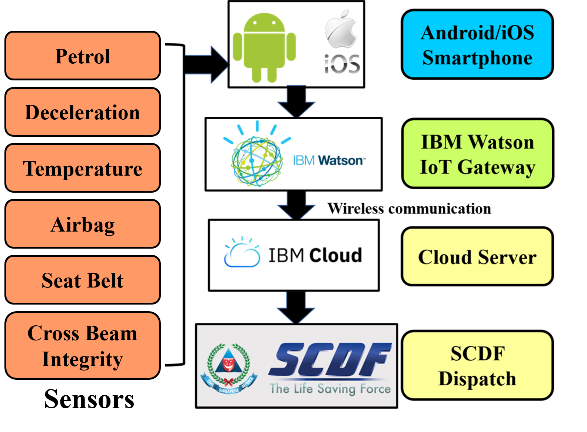
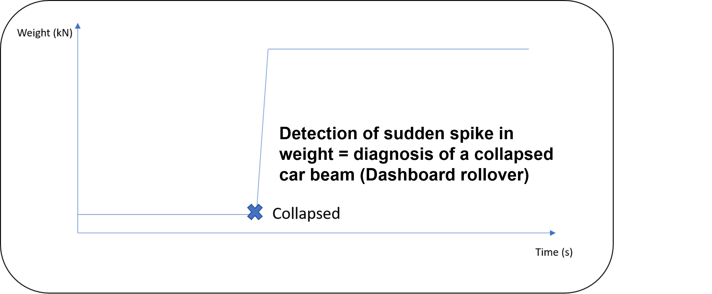

# 31Coders-RTADispatch_SCDFXIBM
Reducing response time to Road Traffic Accidents 

## Description

**Team Introduction**

Our group is made up of three members, Aqil Akram, Raghav Nair, and Sean Manik. Both Aqil and Raghav will be studying Computer Science in NTU and NUS starting this year, while Sean will begin his Computer Science course at NUS in 2021. Our group name, 31 Coders, is inspired by the fire station in which we have each served our National Service in. As section commanders and firefighters in Yishun Fire Station, we have witnessed the challenges faced by Emergency Responders when responding to Road Traffic Accidents (RTAs). 

**Project Description**

With better law & enforcement and stringent regulations, the overall traffic situation in Singapore has improved over the years. However, Road Traffic Accidents still occupy a substantial percentage of cases SCDF Emergency Medical Services and Fire & Rescue Department respond to daily. In 2019, there were 7,666 road traffic accidents resulting in injuries and 117 fatalities. While SCDF has continued to upgrade and improve on operational proficiency, our reponse procedure as remained stagnant over the years when concerning RTAs. For a case to be registered, a member of public has to witness the incident, call 995, and relay concise information to the Ops Centre Operator. Based on experience, the full process can take 5-10 minutes. At the same time, RTAs are extremely time sensitive. Victims of RTAs have a statsitical "golden hour" from the time of accident within which they have to be brought to a hospital to ensure a high probablity of survival. Not to mention an ever-present risk of fuel ignition as a consequence of RTAs. 

However, with Internt of Things (IoT), we might just have a breakthrough. By using this program we have developed, we hope to decrease SCDF's response time to RTA cases. 
Our solution involves leveraging the advancements in Internet of Things technology to bring about an instantaneous diagnosis of the severity of car crashes. This data will then be rapidly analyzed to generate a list of appliances required to provide an effective response to the situation. Ideally, all essential appliances would then be dispatched from the nearest fire station. Through our solution, we are able to save a considerable amount of time from the combination of time spent waiting for a bystander to make a call, time taken for the situation to be explained, and time expended as dispatchers decides on which tiered response is appropriate. 
## Pitch Video
## Architecture of our proposed solution

## Hyperlink to our solution
To begin, we will be using sensors in cars which will then be connected to the internet via the smartphones of the driver. These sensors test for heat levels, petrol concentration, deceleration, airbag deployment, seat belt usage, and integrity of cross car beams. Upon experiencing abnormal measurements, specific amount of points will be generated. A point system is then used to determine the level of tiered response that SCDF should adopt. This will then allow appliances to be dispatched much more quickly while also providing responders with remote diagnosis of the condition of both the casualty and the vehicles. In addition, responders will be able to formulate clear rescue plans enroute, thus contributing to the enhancement of the quality of aid rendered.

The first hurdle that our team has to overcome is to successfully implement the relevant sensors onto a car. There are six sensors that we chose to focus on. They are sensors that detect deceleration, temperature, airbag deployment, seat belt usage, petrol fumes and cross beam integrity. We plan to use incorporate the first four sensors into existing technologies. Deceleration and airbag deployment sensors are already present in a car's crash detection system. Cars have thermistors as well to warn drivers of possible overheating. Modern cars also have seat belt usage detection functions. As such, these sensors are already implemented in cars today and we simply have to connect them to the internet for the facilitation of their use in our solution.

For petrol fumes, we have done research into the prices of petrol vapor detectors and found them to be extremely affordable. They are in the price range of $100-$200 and this is negligible compared to the cost of a car. Hence, we believe that the inclusion of a petrol fume sensor in cars is highly feasible. For the cross car beam integrity sensor, we have decided to use weight sensors to determine whether the beam is dislodged. This is an essential part of our diagnostics system because one of the most common occurences during RTAs is that the cross car beam collapses and traps the driver in the car. 

Understanding the level of structural integrity of the beam will allow us to determine whether an extrication unit and toolset is required. In the following visual, we have illustrated how the beam can fall and we have identified two spots where we can place our weight sensors at.

The cross car beam is known to be extremely heavy and we are confident that its collapse will result in noticeable spike in weight readings as illustrated below.

During a car accident, our sensors will record abnormal readings and this data will be sent to the IBM Watson IoT Edge Gateway where our program would be calculating the severity of the incident through a point system. The program then decides the tier of response required for the incident and sends out this information to the Cloud. SCDF then has access to this information and can authorize a dispatch immediately. In the following table, we have detailed the point system which we would follow.

The total number of points will then be tabulated and a suitable response will be decided upon. We drew upon SCDF's RTA response tiers to develop a system that our program can follow to recommend a suitable level of dispatch for the incident.

We have also developed another way to determine whether there is a casualty trapped in the car. Upon activation of a Tier 1 response, an alarm in the car will be sounded. The driver has 30 seconds to deactivate the alarm through a button in the car or on his phone. If this alarm is not deactivated, the casualty is assumed to be trapped and a Tier 2 response with extrication capabilities will be dispatched. This will allow SCDF to avoid responding to non-emergency minor accidents. In addition, during the 30-second timeframe, Tier 2 response appliances can be put on standby to get rescue personnel ready, thus facilitating a quicker dispatch.
## Proposed timeline

## GGetting started
## Running the tests
## Live demo
### What we used to build our solution
We used the following services to build our solution.

### Cloud Foundry

### Node.js

### IBM IoT Platform

