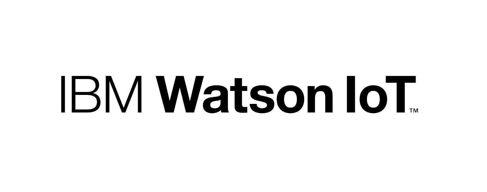

# 31Coders-RTADispatch_SCDFXIBM
Reducing response time to Road Traffic Accidents 

## Description
Our solution aims to improve response times to road traffic accidents through the use of IoT technology. With data provided by the various sensors that we will fit onto a car, we hope to provide rapid diagnosis of damages caused in an accident and initiate an instantaneous dispatch. Responders can then get accident victims to hospitals quickly, raising survival rates and SCDF's overall response effectiveness.

**Team Introduction**
Our group is made up of three members, Aqil Akram, Raghav Nair, and Sean Manik. Both Aqil and Raghav will be studying Computer Science in NTU and NUS starting this year, while Sean will begin his Computer Science course at NUS in 2021. Our group name, 31 Coders, is inspired by the fire station in which we have each served our National Service in. As section commanders and firefighters in Yishun Fire Station, we have witnessed the challenges faced by Emergency Responders when responding to Road Traffic Accidents (RTAs). 

**Project Description**
With better law & enforcement and stringent regulations, the overall traffic situation in Singapore has improved over the years. However, Road Traffic Accidents still occupy a substantial percentage of cases SCDF Emergency Medical Services and Fire & Rescue Department respond to daily. In 2019, there were 7,666 road traffic accidents resulting in injuries and 117 fatalities. While SCDF has continued to upgrade and improve on operational proficiency, our reponse procedure as remained stagnant over the years when concerning RTAs. For a case to be registered, a member of public has to witness the incident, call 995, and relay concise information to the Ops Centre Operator. Based on experience, the full process can take 5-10 minutes. At the same time, RTAs are extremely time sensitive. Victims of RTAs have a statsitical "golden hour" from the time of accident within which they have to be brought to a hospital to ensure a high probablity of survival. Not to mention an ever-present risk of fuel ignition as a consequence of RTAs. 

However, with Internet of Things (IoT), we might just have a breakthrough. By using this program we have developed, we hope to decrease SCDF's response time to RTA cases. Our solution involves leveraging the advancements in Internet of Things technology to bring about an instantaneous diagnosis of the severity of car crashes. This data will then be rapidly analyzed to generate a list of appliances required to provide an effective response to the situation. Ideally, all essential appliances would then be dispatched from the nearest fire station. Through our solution, we are able to save a considerable amount of time from the combination of time spent waiting for a bystander to make a call, time taken for the situation to be explained, and time expended as dispatchers decides on which tiered response is appropriate. 
## Pitch Video
## Architecture of our proposed solution

## Hyperlink to our solution
https://docs.google.com/document/d/13d2gSMU3XQPFQ79sRLEenR5D2vPUgW9KoJJeVWHeovM/edit
## Proposed timeline

## Live demo
### What we used to build our solution
We used the following services to build our solution.

### Cloud Foundry

### Node.js

### IBM IoT Platform

